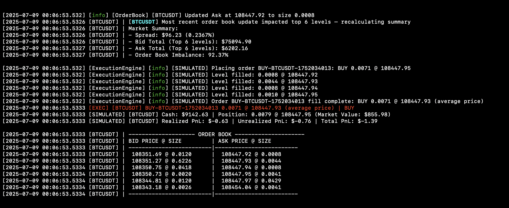

# Trading Bot

A real time trading system built for experimentation and strategy development, using Binance US crypto data as a convenient, 24/7 live and free feed.

The system is fully event driven, the trading logic reacts instantly to live market data updates without polling or delay.

## Features

This trading bot is built in C++ with multithreading, using dedicated threads per symbol. This design enables concurrent processing of live market data and order execution across any number of user defined assets. You can add or remove symbols simply by editing the config file, without needing to modify the source code.

The bot maintains real time order books by combining full snapshots fetched from REST APIs with streaming incremental updates received via WebSockets. It continuously monitors the top 6 levels of each order book and only triggers trading logic when these top levels change, ensuring efficient and responsive decision making.

Simulated order execution models realistic market behavior, supporting partial fills and average price tracking. Profit and loss (PnL) is tracked in real time, providing an accurate performance view throughout trading.

**Output:** The system prints real time summaries, order book snapshots, and simulated trades directly to the console. Whenever there is a meaningful change in the top 6 order book levels, the bot prints updated market summaries, order book depths, and real time trade activity. This enables clear and immediate visibility into both market state and strategy driven order execution.

**Note**: In nearly all cases, output is printed in the intended order. However, due to the multithreaded nature of both the C++ backend and Python strategy, there may occasionally be slight timing discrepancies in the console output. For example, C++ limit order book updates might appear just before their associated Python calculated summaries. Everything is working as expected from a calculation standpoint, this is simply a minor delay in output timing and does not affect the bot’s behavior.

## Getting Started

### Prerequisites

- C++17 compatible compiler
- CMake 3.15 or newer
- Boost libraries (system, thread)
- OpenSSL
- spdlog
- nlohmann_json
- libcurl
- Python 3.x

### Clone and Build

```bash
git clone https://github.com/michaeltgit/trading-bot.git
cd trading-bot

mkdir build && cd build
cmake ..
make

./trading_bot   # Basic orderbook functionality

cd ..           # Return to project root
PYTHONPATH=build python3 strategy/main_strategy.py   # Run the full Python-based strategy loop
```

## Live Feed Example
[](https://www.youtube.com/watch?v=quIsbhoqdBY)

Demo of `trading-bot-v1` during a liquidity spike. Watch how the system reacts to rapid market changes in real time.

---

## Simulated Order Fills


Sample trade execution with fill logic and real time PnL tracking from the bot.

> Notes:
> 1. This screenshot was captured under the old order calculation logic. The bot would not have made this trade under the revised logic due to the high spread, but nevertheless it is still illustrative.
> 2. It's normal for initial unrealized PnL to appear negative immediately after a trade. This happens because buys are simulated at the ask price, while the position is valued using the top bid.

## Tech Stack

- C++17
- Boost.Asio and Boost.Thread (networking & concurrency)
- OpenSSL (secure WebSocket connections)
- spdlog (logging)
- nlohmann_json (JSON parsing)
- libcurl (REST API snapshots)
- pybind11 (Python bindings)
- Python 3.x (strategy scripting)

## Project Structure

```bash
trading-bot/
├── include/trading/          # C++ core headers
│   ├── config.hpp
│   ├── execution_engine.hpp
│   ├── execution_report.hpp
│   ├── limit_order_book.hpp
│   ├── market_data_connector.hpp
│   ├── new_order.hpp
│   ├── order_state.hpp
│   ├── risk_manager.hpp
│   ├── symbol_worker.hpp
│   └── telemetry.hpp
├── src/                      # C++ core source files
│   ├── config.cpp
│   ├── execution_engine.cpp
│   ├── limit_order_book.cpp
│   ├── main.cpp
│   ├── market_data_connector.cpp
│   ├── risk_manager.cpp
│   ├── symbol_worker.cpp
│   └── telemetry.cpp
├── strategy/                 # Python strategy scripts
│   ├── config.py
│   ├── main_strategy.py
│   ├── pnl.py
│   ├── print_utils.py
│   └── order_calculator.py
├── tests/                    # Unit tests for C++ core
│   ├── test_config.cpp
│   ├── test_execution_engine.cpp
│   ├── test_limit_order_book.cpp
│   ├── test_market_data_connector.cpp
│   ├── test_risk_manager.cpp
│   └── test_telemetry.cpp
├── extern/                   # External dependencies
├── config.cfg                # Configuration for symbols and settings
├── CMakeLists.txt            # Build configuration
├── README.md
└── .gitignore                # Git ignore rules
```

## License

N/A